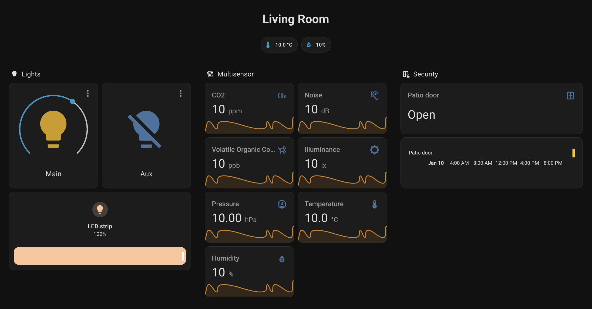

# Home Assistant Grenton

Custom Home Assistant integration for **Grenton Smart Home** system. Seamlessly connect and control your Grenton devices through Home Assistant with automatic discovery, real-time updates, and full configuration support.

## 💖 Sponsor

If you find this integration helpful, please consider supporting ongoing development via [**GitHub Sponsors**](https://github.com/sponsors/sszczep).

Your support helps maintain features, fix bugs, and improve documentation.

## ✨ Features

- **🔌 Automatic Device Discovery** - Connects to Grenton Object Manager and automatically discovers all configured devices
- **🏠 Multiple Widget Types** - Support for lights, switches, dimmers, sensors, covers, and more
- **⚙️ Per-Entity Configuration** - Customize device class and unit of measurement for each supported entity through the UI
- **🔄 Real-time Updates** - Automatic state synchronization with Grenton system
- **🌍 Multi-language Support** - Fully translated UI in English and Polish
- **📱 Modern UI** - Native Home Assistant integration with clean configuration flows

## 📦 Supported Widgets

| Widget Type (Literal) | Description |
|-----------------------|-------------|
| **VALUE_V2** | Single numeric value exposed as `sensor` with configurable device class/unit. |
| **VALUE_DOUBLE** | Dual numeric values exposed as two `sensor` entities (A/B). |
| **ON_OFF** | Single relay exposed as `switch`. |
| **ON_OFF_DOUBLE** | Dual relays exposed as two `switch` entities. |
| **DIMMER_V2** | Dimmable light exposed as `light` with brightness (0-100%). |
| **LED** | LED or RGB/RGBW light exposed as `light` with brightness and color where available. |
| **CONTACT_SENSOR** | Contact/door/window sensor exposed as `binary_sensor`. |
| **CONTACT_SENSOR_DOUBLE** | Dual contact channels exposed as two `binary_sensor` entities. |
| **SLIDER** | User-configurable numeric control exposed as `number` (slider/box/auto modes). |
| **MULTISENSOR** | Composite multi-channel sensor mapped to multiple `sensor` entities (as provided). |
| **ROLLER_SHUTTER** | Legacy roller shutter exposed as `sensor` (state enum) plus a `button` action entity. |
| **ROLLER_SHUTTER_V3** | Roller shutter V3 exposed as a single `cover` entity (position; lamel/tilt when available). |
| **CAMERA** | Camera stream exposed as `camera`. |

## 🚀 Installation

### Option 1: HACS (Recommended)

1. Open [HACS](https://www.hacs.xyz/docs/use/download/download/) in your Home Assistant instance
2. Go to **Integrations**
3. Click the three dots in the top right corner
4. Select **Custom repositories**
5. Add this repository URL: `https://github.com/sszczep/homeassistant-grenton`
6. Select **Integration** as the category
7. Click **Install**
8. Restart Home Assistant

### Option 2: Manual Installation

1. Download the latest release from the [Releases](https://github.com/sszczep/homeassistant-grenton/releases) section
2. Extract the zip file
3. Copy the `homeassistant_grenton` folder into your `custom_components` directory (usually `/config/custom_components/`)
4. Restart Home Assistant

## 📖 Configuration

### Initial Setup

1. Go to **Settings** → **Devices & Services**
2. Click **Add Integration**
3. Search for **"Grenton"**
4. Enter your Grenton Object Manager connection details:
   - **IP Address**: IP address of your Grenton Object Manager
   - **Port**: Port number (default: `9998`)
   - **PIN**: Your Object Manager PIN code

### Entity Configuration

After initial setup, you can customize individual entities:

1. Navigate to **Settings** → **Devices & Services** → **Grenton**
2. Click **Configure** on the integration
3. Select an entity from the dropdown menu
4. Configure entity properties:
   - **Sensors**: Choose device class and unit of measurement
   - **Sliders (Numbers)**: Set display mode, device class, and unit
   - **Binary Sensors**: Select appropriate device class

The integration intelligently filters available options based on your selections and automatically skips unnecessary configuration steps.

## 🎨 Device Classes & Units

### Sensor Device Classes

The integration supports all Home Assistant sensor device classes:

- **Environmental**: Temperature, Humidity, Atmospheric Pressure, Air Quality Index
- **Energy**: Power, Energy, Voltage, Current, Apparent Power, Reactive Power
- **Environmental Monitoring**: CO, CO2, VOC, PM1, PM10, PM2.5
- **Physical**: Distance, Speed, Weight, Volume, Pressure
- **And many more...**

### Number (Slider) Device Classes

Configure sliders with appropriate device classes for proper representation:

- Display modes: Auto, Slider, Box
- Device classes: Temperature, Humidity, Power, Voltage, Current, etc.
- Automatic unit filtering based on device class

### Binary Sensor Device Classes

- **Safety**: Battery, Cold, Heat, Gas, Smoke, CO
- **Security**: Door, Window, Opening, Lock, Motion, Occupancy
- **Connectivity**: Connectivity, Power, Plug
- **System**: Problem, Running, Update, Vibration

## 🐛 Troubleshooting

### Connection Issues

**Cannot connect to Grenton Object Manager:**

1. Verify IP address and port are correct
2. Ensure Home Assistant can reach the Grenton network
3. Check PIN code is correct
4. Review Home Assistant logs: **Settings** → **System** → **Logs**

### Configuration Not Saving

**Entity configurations don't persist:**

1. Complete all configuration steps
2. Ensure you clicked **Submit** on the final step
3. Check integration logs for errors
4. Restart Home Assistant and try again

### Device Not Appearing

**Device discovered but not showing in UI:**

1. Check device is properly configured in Grenton Object Manager
2. Verify device type is supported (see Supported Devices table)
3. Review coordinator logs for device mapping errors
4. Force integration reload: **Settings** → **Devices & Services** → **Grenton** → **⋮** → **Reload**

### State Not Updating

**Device state not synchronized:**

1. Check Grenton Object Manager is running and accessible
2. Verify network connectivity between Home Assistant and Grenton
3. Review coordinator update interval (default: 30 seconds)
4. Check Grenton device is responding to queries

## 📝 License

This project is licensed under the **GNU General Public License v3.0**.

- You may run, study, share, and modify the software under the terms of GPL-3.0.
- Redistributions and derivative works must also be licensed under GPL-3.0 and include the source code.

See the full text in the [LICENSE](LICENSE) file.

## 🤝 Contributing

Contributions are welcome! Please:

1. Fork the repository
2. Create a feature branch: `git checkout -b feature/amazing-feature`
3. Commit your changes: `git commit -m 'Add amazing feature'`
4. Push to the branch: `git push origin feature/amazing-feature`
5. Open a Pull Request

## 📧 Support

For issues, questions, or contributions:

- **GitHub Issues**: [Report a bug or request a feature](https://github.com/sszczep/homeassistant-grenton/issues)
- **Discussions**: [Ask questions and share ideas](https://github.com/sszczep/homeassistant-grenton/discussions)
- **GitHub Sponsors**: [Sponsor ongoing development](https://github.com/sponsors/sszczep)

## 💖 Sponsor

If you find this integration helpful, please consider supporting ongoing development via [**GitHub Sponsors**](https://github.com/sponsors/sszczep).

Your support helps maintain features, fix bugs, and improve documentation.

## 🙏 Acknowledgments

- Home Assistant community for the excellent platform
- Grenton for their smart home system
- All contributors and users of this integration

---

**Made with ❤️ for the Home Assistant community**

[Report Bug](https://github.com/sszczep/homeassistant-grenton/issues) · [Request Feature](https://github.com/sszczep/homeassistant-grenton/issues) · [Discuss](https://github.com/sszczep/homeassistant-grenton/discussions)

